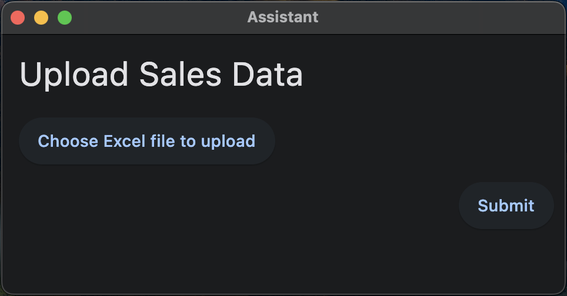

# Dialogs Upload File Example Robot

This robot demonstrates the use of the [`RPA.Assistant`](https://robocorp.com/docs/libraries/rpa-framework/rpa-assistant) library that allows the user to choose and upload an Excel file which is then used by the robot to fill a form in a web application.

The `ExampleExcelFile.xlsx` in the main directory of the robot contains data with the right structure and can be used to test the robot.

This example builds on top of the `robotsparebin-complete` example, which is explained in detail in the [Robot Software Developer Beginners's course](https://robocorp.com/docs/courses/beginners-course).

This example is very suited to be used with the [Robot Assistants feature of Control Room](https://robocorp.com/docs/control-room/operating-assistants/using-assistant-robots).

> You can find more information on this example robot on [Robocorp's documentation site](https://robocorp.com/docs/development-guide/dialogs-assistant/uploading-files).
